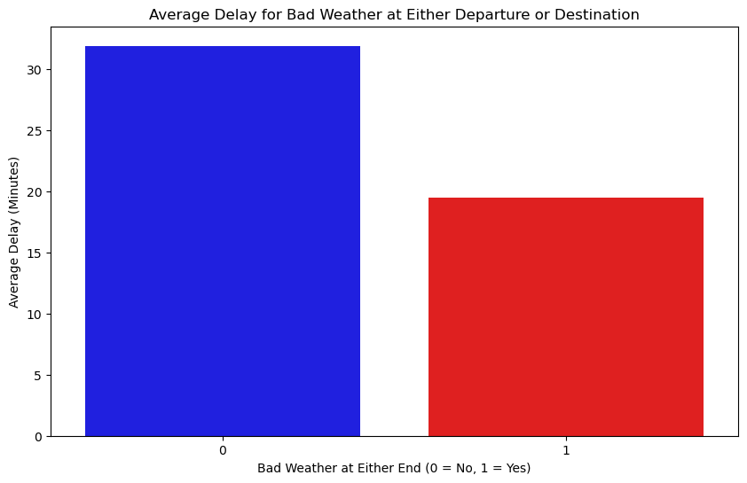

# Report: Flight Delay Analysis Project

## Table of Contents
- [Report: Flight Delay Analysis Project](#report-flight-delay-analysis-project)
  - [Table of Contents](#table-of-contents)
  - [Introduction](#introduction)
  - [Project Goals](#project-goals)
  - [Pipeline](#pipeline)
    - [Data Sources](#data-sources)
    - [Ingestion Phase](#ingestion-phase)
    - [Staging Phase](#staging-phase)
      - [Data Cleansing](#data-cleansing)
      - [Data Transformations](#data-transformations)
      - [Enrichments](#enrichments)
    - [Production Phase](#production-phase)
      - [Analysis and Queries](#analysis-and-queries)
  - [Findings](#findings)
  - [Challenges Faced](#challenges-faced)
  - [Future Developments](#future-developments)

## Introduction
This project focuses on analyzing airline flight delays and their correlation with weather conditions at both departure and destination airports. Delays in air travel are a significant concern for airlines and passengers, as they affect operational efficiency and customer satisfaction. Understanding the factors contributing to delays, particularly weather, can provide valuable insights for improving airline operations and passenger experience.

The data used in this project includes detailed flight records and weather information such as wind speed, visibility, sky conditions, and temperature. By combining these datasets, we aim to uncover patterns and trends that highlight the impact of weather on flight delays.

## Project Goals
The project seeks to answer the following key questions:

Which airlines experience the most delays?
Identify the airlines with the highest frequency of delays to understand whether certain carriers face systemic issues.

Do bad weather conditions at the departure airport increase delays?
Examine whether factors such as high wind speeds, poor visibility, and adverse sky conditions contribute to delays when flights depart.

Do bad weather conditions at the destination airport increase delays?
Investigate how adverse weather conditions at arrival airports might correlate with delays.

## Pipeline

### Data Sources
The project utilizes two primary data sources:

Flight Data:
- Source: Aviation Edge API
- Scope: Direct flights between Orlando, Florida (MCO), and Palm Beach, Florida (FLL)
- Timeframe: January 1st to January 9th
- Details: Includes flight schedules, delays, and other operational data.

Weather Data:
- Source: Aviation Weather API
- Details: Weather conditions at both departure and destination airports, including wind speed, visibility, temperature, and sky conditions.

### Ingestion Phase
In the ingestion phase, data was fetched from various APIs and stored locally for further processing. The following steps were undertaken:

Flight Data Ingestion:
- The ingest_flight_data function was used to fetch flight history data for specified airports (MCO & FLL) from the Aviation Edge API.
- A rolling 10-day date range was used to retrieve flight records.
- The ingested data was stored in temporary JSON files.

Weather Data Ingestion:
- The ingest_weather_data function fetched weather data (e.g., wind, visibility, sky condition, temperature) from the Aviation Weather API.
- Weather data was collected for departure and arrival airports over the same date range as the flight data.
- The raw weather data was saved as JSON for further processing.

### Staging Phase

#### Data Cleansing before loading JSON to Postgres
Flight Data:
- Filtered flights to include only those departing from MCO or FLL and arriving at valid destinations.

#### Data Cleansing on Postgres relations
Weather Relation:
- Cleaned weather data to exclude rows with invalid formats:
  - Wind values ended with "KT".
  - Verified visibility values ended with "SM".
  - Filtered sky conditions to exclude improperly formatted entries.
  - Validated temperature and altimeter readings for numeric formats.

Flight Relation:
- Filtered flights for which no previous weather data was available in both departure and destination airports.

#### Data Transformations
Timestamp Standardization:
- Updated timestamps to conform to ISO 8601 standards, replacing lowercase "t" with uppercase "T" where necessary.

Association of Weather and Flights:
- Associated flights with the most recent weather records at both departure and arrival airports using PostgreSQL queries.
Updated flight records with departure_weather_id and destination_weather_id fields.

### Production Phase
In the production phase, cleaned and enriched data was exported for analysis and visualization.

CSV Export:
- The export_flights_with_weather function was used to generate a comprehensive CSV file containing flight details along with associated weather conditions.
- The exported file included columns for flight schedules, delays, weather metrics (e.g., wind, visibility), and airline identifiers.

Analysis Ready Dataset:
- The exported dataset served as the input for further analysis to answer the project's key questions, including:
- Identifying airlines with the most delays.
- Analyzing the correlation between weather conditions and delays.

## Analysis and Queries
The analysis phase of our **Flight Delay Analysis Project** leveraged Python libraries such as **pandas**, **matplotlib**, and **seaborn** to explore the behavior of flight delays and their relationship with weather conditions at both departure and destination airports. We examined various dimensions of flight delays across airlines, weather metrics, and time intervals to gain insights into how adverse weather impacts airline punctuality.

Our analysis was conducted on a dataset comprising detailed flight records and corresponding weather data for each flight’s departure and arrival points. The steps involved grouping and visualizing data to identify correlations and patterns related to delays and bad weather conditions. In this section we are presenting our five main analysis.

### Key Analyses Performed

#### 1. Impact of Bad Weather Conditions
We started by creating binary flags for **BadWeatherDeparture** and **BadWeatherDestination** and combined them to generate a **BadWeatherEither** metric. The average delays were then calculated under different weather conditions to analyze the extent to which bad weather influences delays.

#### 2. Categorizing Delay Types
Flight delays were categorized into **short delays** (<= 15 minutes), **moderate delays** (15-30 minutes), and **long delays** (> 30 minutes). We plotted the distribution of these delay types across various dates to observe how the severity of delays varied over time.

#### 3. Correlation Between Weather and Delays
We computed the **normalized delay rate** by comparing the number of delayed flights to the total number of flights under both **good weather** and **bad weather** conditions. The results were visualized through bar plots showing the likelihood of delays in different weather scenarios.

#### 4. Daily Delay Patterns
We examined daily trends in average delays by grouping data by **date** and calculating the **mean delay** for each day. Using **seaborn line plots**, we visualized daily fluctuations in delays. Additionally, we separated these visualizations into two line plots: one for **good weather days** and another for **bad weather days**, followed by a combined comparison chart.

#### 5. Average Delay by Airline under Bad Weather Conditions
We finally grouped the data by airline and **BadWeatherEither** (a metric indicating bad weather at either the departure or destination airport) to calculate the **mean delay** for each airline in both **good** and **bad weather** conditions. This allowed us to observe how different airlines are affected by adverse weather conditions. The results were visualized using a **stacked bar plot**, showing the average delays experienced by each airline in both weather scenarios.

### Main Findings and Obersavtions
This section presents the key findings from our analysis, focusing on how weather conditions impact flight delays across different airlines and time periods.

#### 1. Average Delay for Bad Weather at Either Departure or Destination

Our first key finding examines the **average flight delay** under **bad weather conditions** at either the **departure** or **destination airport**. The plot below shows that flights with **no bad weather (0)** experienced a longer average delay compared to flights with **bad weather (1)**.

The surprising insight here is that, on average, **flights with good weather had longer delays**. This suggests that factors other than weather, such as **operational issues**, **traffic volume**, or **scheduling inefficiencies**, could be playing a larger role in determining flight delays.

---

#### 2. Comparison of Average Flight Delay by Date (Good vs. Bad Weather)

Our second key finding examines the **average flight delays by date**, comparing delays experienced on **good weather days** and **bad weather days**. The plot below shows the trend of **average delay times** over the analyzed time period, highlighting the differences between flights operating in good and bad weather conditions.

The key insights from this analysis include:
- **Bad weather conditions** consistently result in **longer delays** compared to good weather conditions.
- The difference in delays is most pronounced on certain days, such as **January 4th and 6th**, where bad weather resulted in **average delays exceeding 40 minutes**.
- On days with **good weather**, the average delays remain relatively lower and more consistent.

This plot helps us understand how weather impacts flight delays on a daily basis and emphasizes the need for airlines to account for weather conditions in their operational planning.

---

#### 3. Average Delay by Airline under Bad Weather Conditions (Departure or Destination)

Our final key finding shows the impact of **bad weather conditions** on the **average delay** experienced by different airlines. The plot below illustrates the **average delay (in minutes)** for each airline in both **good weather (0)** and **bad weather (1)** scenarios, where **bad weather** is defined as adverse weather conditions at either the departure or destination airport.

The analysis highlights several key insights:
- **Delta Air Lines**, **CSI Aviation**, and **Fly Alliance** show a noticeable increase in delays under bad weather conditions compared to good weather conditions.
- Most of the other airlines have relatively consistent delay times, regardless of weather conditions, suggesting better handling of weather-related disruptions.

This plot helps to emphasize that airlines react differently to weather conditions, and some airlines are more resilient to bad weather disruptions than others. The varying levels of delay indicate that weather preparedness strategies and operational efficiencies may vary significantly between carriers.

### Conclusion

The findings of this analysis indicate that weather conditions, especially at either the departure or destination airport, have an observable impact on flight delays. However, some results were **unexpected**, such as flights in **good weather conditions** showing longer average delays compared to bad weather days in certain cases. This suggests that other factors, such as **operational inefficiencies**, **air traffic volume**, or **scheduling issues**, may play a significant role in causing delays, even in the absence of adverse weather.

While the analysis reveals valuable trends and insights, it is essential to interpret the results with caution due to the **limited dataset size** and the **short time frame** covered by the data. Despite these limitations, the findings provide a solid starting point for further research and emphasize the importance of considering multiple factors when analyzing flight delays.

---

## Challenges Faced
Despite the meaningful insights gained, several challenges were encountered during the analysis process.
1. Data Accessibility: many APIs, such as the Aviation Edge API, require premium subscriptions for accessing historical data: we had to ask the saling team to get a free API key, which caused some delay in the project. Fortunately, the Aviation Weather API is free of charge.
2. Parsing METAR Weather Information: METAR weather data is highly technical and requires significant domain knowledge to interpret, especially because some METAR data were not including the same fields (wind direction, visibility, sky condition, and temperature). We had to use regular expressions to parse specific patterns in METAR strings, and apply filtering logic to discard incomplete or malformed data entries, such as weather rows with missing values or unexpected formats.
3. Correlation Analysis Challenges: The data set was relatively small, with only about 150 flights available for analysis over a 10-day period. It was impossible to take more data since the weather data before 2024-12-30 was not available. This limited the statistical power of our correlation analysis, making it difficult to draw robust conclusions about the relationships between flight delays and weather conditions. Since the focus was on a specific route or airport pair (MCO to FLL), the lack of diversity in routes further constrained the generalizability of the findings. Moreover, it would be more than useful if the flight dataset included the cause of delay. It would enable us to answer the question: "Are the delayed flights, publicly announced as delayed because of the weather, actually delayed because of the weather?"

## Future Developments
1. Add More Routes: Expanding the analysis to include multiple routes and airports would provide a larger and more diverse dataset, allowing for more robust statistical analyses and insights. This would also help generalize findings to broader flight networks and not just specific pairs of airports.
2. Improved Data Sources: Partnering with additional API providers or acquiring premium subscriptions to services like Aviation Edge would allow access to richer historical and real-time flight and weather data. Integrating multiple data sources could also improve the accuracy of weather condition mapping and delay analysis.
3. Machine Learning for Delay Prediction: Leveraging machine learning models, such as regression or classification algorithms, would enable the analysis of complex weather conditions and their impact on flight delays. These models could also incorporate other variables (e.g., air traffic, airline performance) to predict delays with higher precision.
4. Real-Time Analysis: Developing a real-time analysis capability would allow airlines and passengers to receive up-to-date information about potential delays due to weather. This could be implemented using streaming data pipelines, real-time APIs, and dashboards for live monitoring.
5. Scaling the Pipeline: Scaling the data pipeline to handle larger datasets and more airports/routes would require optimization of data ingestion, storage, and processing. Using distributed systems, cloud-based storage, and parallel processing frameworks could help handle the increased load efficiently.